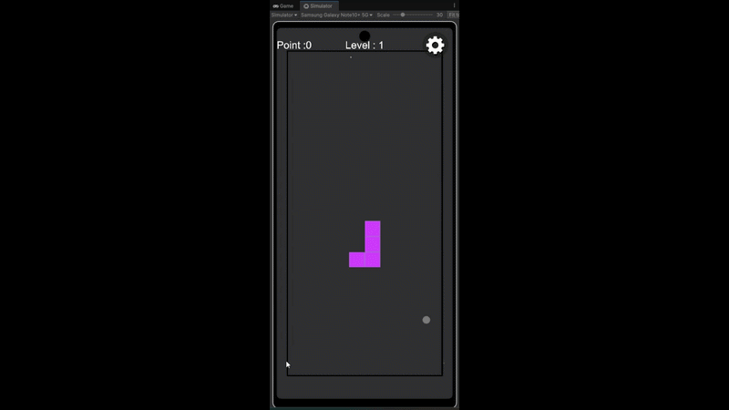
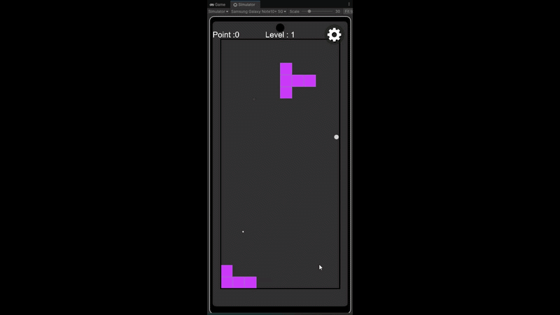
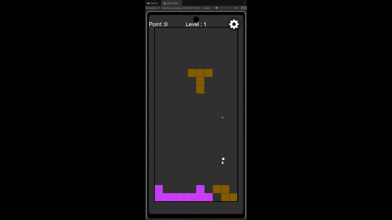

# Brick Space

A casual mobile puzzle game developed with Unity.

## Gameplay

- Moving the block forward

- Change between two directions

- Get Points
  

## Features

- Block movement and rotation
- Two movement directions
- Score points when both directions are filled
- Online mode

## Tech Stack

- Unity
- C#
- DOTween
- photon

## How to Run

1. Clone repository

git clone [https://github.com/username/brick-space](https://github.com/kalimatar3/Testris-2.75D.git)

2. Open with Unity Hub (Unity 6+)
3. Open scene Assets/Scenes/GamePlay.unity
4. Press Play
